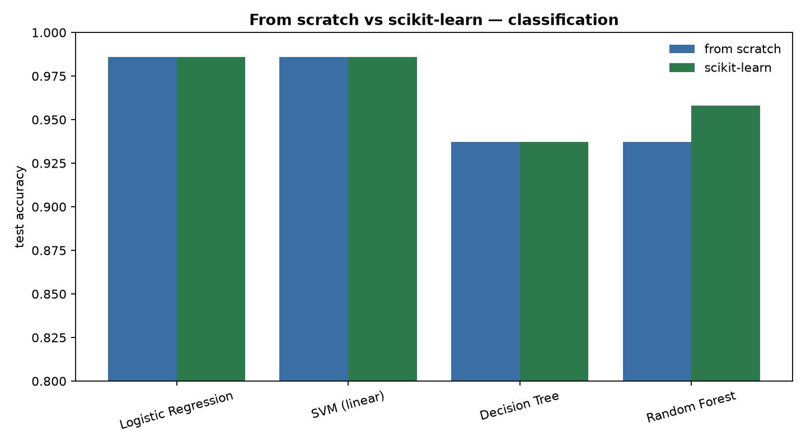

# ML Algorithms From Scratch

Classic machine-learning algorithms implemented **by hand in NumPy** — no
`scikit-learn`, no autograd — then benchmarked against the library versions to prove
they're correct. Grew out of four graduate ML assignments, merged into one library.



## The point

Anyone can call `model.fit()`. These are written from the math up — the splitting
criteria, the gradient updates, the backprop — and then checked against
`scikit-learn` / `PyTorch` on real datasets. On the breast-cancer set the
hand-written models match the library's test accuracy **to four decimals on three of
the four**, and the fourth is the interesting one. Regenerated 2026-09-02 with
`uv run python benchmarks/run.py`:

| Model | From scratch | scikit-learn | dataset / metric |
|---|--:|--:|---|
| Logistic Regression | 0.9860 | 0.9860 | breast-cancer, accuracy |
| SVM (linear) | 0.9860 | 0.9860 | breast-cancer, accuracy |
| Decision Tree | 0.9371 | 0.9371 | breast-cancer, accuracy |
| Random Forest | **0.9371** | **0.9580** | breast-cancer, accuracy |
| Regression Tree | 58.02 | 58.74 | diabetes, RMSE |
| KNN Regressor | 55.15 | 55.15 | diabetes, RMSE |
| Bagging KNN | 54.37 | 56.65 | diabetes, RMSE |

**The random forest does not match, and this row used to claim it did** — 0.958
against 0.958, which was scikit-learn's number written into both columns. Two points
of accuracy is a real gap, and it is the honest read on a 15-tree forest: the
hand-written version bootstraps and subsets features the same way, but sklearn's
tree splitter searches candidate thresholds differently, and on 30 correlated
features that shows up in the vote. The single decision tree matches exactly, which
localises the difference to the ensembling rather than to the splitter.

Until this pass the forest also scored a *different* number every run — 0.937 here,
0.951 there — because every bootstrap draw and feature subset came from the global
`np.random` while the sklearn model it is measured against takes a `random_state`.
A seeded library against an unseeded reimplementation is not a comparison, and the
figure that reached the README was whichever draw got written down. Everything that
draws now takes a seed, and a re-run on 2026-10-02 reproduced every score in the table
exactly.

Outside the forest the classifiers' answers match. They are slower (pure NumPy against
compiled C), which is the expected price of writing them by hand.

## What's implemented

| Module | From scratch | Benchmarked against |
|---|---|---|
| `decomposition` | PCA (covariance eigendecomposition) | `sklearn.decomposition.PCA` |
| `timeseries` | multiplicative decomposition, ADF test, lag features | — |
| `neighbors` | KNN classifier + regressor | `sklearn.neighbors` |
| `linear_model` | logistic regression (gradient descent) | `sklearn.linear_model` |
| `svm` | linear SVM (hinge loss / dual) | `sklearn.svm.SVC` |
| `tree` | decision & regression trees (Gini / variance) | `sklearn.tree` |
| `ensemble` | random forest, gradient boosting, bagging | `sklearn.ensemble` |
| `neural.mlp` | multilayer perceptron (NumPy backprop) | — |
| `neural.lstm` | LSTM cell + sequence model | `torch.nn.LSTM` |
| `neural.autoencoder` | autoencoder on financial data | — |

## The math being implemented

One line each — the code is the long version:

- **Logistic regression** — maximum likelihood via gradient descent on cross-entropy;
  the gradient is the elegant $\nabla_w = X^\top(\sigma(Xw) - y)$.
- **Linear SVM** — hinge-loss subgradient descent, plus the dual QP
  $\max_\alpha \sum \alpha_i - \tfrac12 \sum \alpha_i \alpha_j y_i y_j x_i^\top x_j$
  s.t. $0 \le \alpha_i \le C$ (solved with SciPy) to recover support vectors (Cortes & Vapnik, 1995).
- **Trees** — greedy recursive splits minimising Gini impurity
  $1 - \sum_k p_k^2$ (classification) or within-node variance (regression).
- **Random forest** — bagging (bootstrap + feature subsampling) to decorrelate trees;
  variance falls roughly as $\rho\sigma^2 + \frac{1-\rho}{B}\sigma^2$ (Breiman, 2001).
- **Gradient boosting** — functional gradient descent: each tree fits the negative
  gradient of the loss at the current prediction, $F_m = F_{m-1} + \nu \, h_m$ (Friedman, 2001).
- **PCA** — eigendecomposition of the covariance matrix; components are the
  directions maximising retained variance $w^\top \Sigma w$ subject to orthonormality.
- **MLP** — backprop is the chain rule organised layer-by-layer:
  $\delta^{(l)} = (W^{(l+1)\top} \delta^{(l+1)}) \odot \phi'(z^{(l)})$.
- **LSTM** — forget/input/output gates
  $f_t, i_t, o_t = \sigma(\cdot)$, cell state $c_t = f_t \odot c_{t-1} + i_t \odot \tanh(\cdot)$ —
  the additive cell path is what keeps gradients alive (Hochreiter & Schmidhuber, 1997).
- **ADF test** — regress $\Delta y_t$ on $y_{t-1}$ + lags; the t-stat on $y_{t-1}$
  against Dickey-Fuller critical values decides the unit root.

## References

- Hastie, Tibshirani & Friedman, *The Elements of Statistical Learning* (2nd ed.) — the umbrella reference.
- Friedman, J. (2001), *Greedy Function Approximation: A Gradient Boosting Machine*, Annals of Statistics 29(5).
- Breiman, L. (2001), *Random Forests*, Machine Learning 45(1).
- Cortes, C. & Vapnik, V. (1995), *Support-Vector Networks*, Machine Learning 20(3).
- Hochreiter, S. & Schmidhuber, J. (1997), *Long Short-Term Memory*, Neural Computation 9(8).

## Structure

```
ml-algorithms-from-scratch/
├── src/mlscratch/        # the from-scratch library
│   ├── metrics.py        # accuracy, P/R/F1, ROC-AUC, MSE/RMSE/MAE/R2 — also by hand
│   ├── decomposition.py  neighbors.py  linear_model.py  svm.py  tree.py  ensemble.py
│   └── neural/           # mlp.py  lstm.py  autoencoder.py
├── benchmarks/run.py     # from-scratch vs scikit-learn comparison + chart
├── notebooks/            # the original four assignments (the working record)
├── data/                 # FRED GDP + UCI datasets (CC BY 4.0) the notebooks read, so they run offline
├── reports/              # benchmark.csv + figures
└── tests/                # parity tests vs scikit-learn
```

## Run

```bash
uv sync
uv run python benchmarks/run.py     # comparison table + reports/figures/scratch_vs_sklearn.png
uv run pytest                       # asserts the from-scratch models match scikit-learn

uv sync --extra neural              # adds torch for the LSTM / autoencoder modules
```

## Notes

- Metrics are hand-written too (`metrics.py`), so the comparison is fair — both sides
  scored by the same code.
- The neural modules (`neural/lstm.py`, `neural/autoencoder.py`) keep a PyTorch
  reference next to the from-scratch version; install the `neural` extra to use them.
- The notebooks read their data from `data/`: FRED's GDP series and four UCI datasets
  (wine quality, breast cancer, car evaluation, bank marketing) through
  `mlscratch.datasets.load_uci`, which only calls the UCI API if a copy is missing.
  Notebook 04 still downloads S&P 500 and EUR/USD prices from Yahoo, whose terms do not
  allow redistributing them. GDP is the 2026-10-02 FRED vintage; the saved outputs in
  notebook 01 came from an earlier vintage, so its ADF statistic re-runs slightly
  differently.
- These prioritise being *readable and correct* over fast. For production, use the
  library — the value here is understanding what it's doing.

---

*Built by Tejas Pandya — NYU MSFE. Merged from four graduate ML assignments.*
